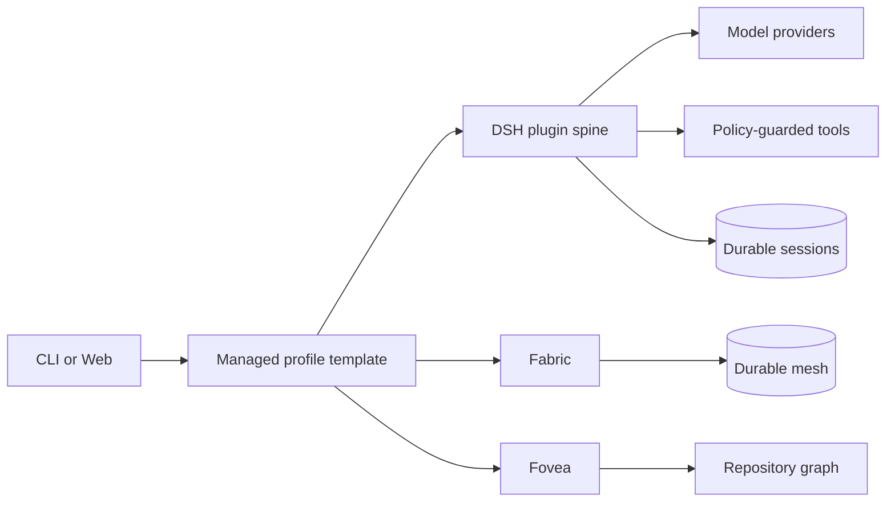

<div align="center">

# 🐟 DeepSeek Harness

**A plugin-native coding-agent harness with Fabric coordination and Fovea repository intelligence included.**

_Run locally in one command, compose every capability, and keep the tested distribution together._

[](https://github.com/deepseek-ai/deepseek-harness/actions/workflows/ci.yml) [](https://www.npmjs.com/package/@monotykamary/dsh) [](package.json) [](LICENSE)

English | [中文](README.zh.md)

</div>

<a id="run"></a>

## Run

```sh
npx @monotykamary/dsh@latest web
```

DSH serves the Web UI at `http://127.0.0.1:3080`. Local launches also open the default browser; SSH launches print the host URL because the forwarding address belongs to the SSH client or editor, and `--no-open` runs only the server. The npm package carries the complete tested closure: [dsh-fabric](https://github.com/monotykamary/dsh-fabric) and [dsh-fovea](https://github.com/monotykamary/dsh-fovea) join every shipped profile, while the long-lived Web profile also includes [dsh-factory](https://github.com/monotykamary/dsh-factory); profiles do not pin separate copies. See the [Web UI guide](docs/user/guide/index.md).

## Why DSH?

| | Capability | What it unlocks |
| :-: | --- | --- |
| 🧩 | **Everything is a plugin** | Replace models, tools, persistence, policy, UI, and orchestration through Cordis composition. |
| 🧠 | **Fabric included** | Deterministic compaction, checked code execution, durable coordination, and live topology. |
| 🔭 | **Fovea included** | Progressive repository navigation and impact analysis without bulk-reading the tree. |
| 🛡️ | **Policy at execution** | Filesystem, subprocess, approval, timeout, and sandbox decisions remain enforceable capabilities. |
| 🔄 | **Cohesive updates** | Settings and CLI report DSH, Fabric, and Fovea together and preserve the installation channel. |
| 🧱 | **Profile layers** | Shipped templates stay current while user patches and out-of-tree bundles remain independently owned. |

## How it fits



Cordis owns plugin lifecycle and reversible effects. The session log owns durable model-visible facts. Profiles layer the current installation-owned template, user-added bundles, profile patches, home patches, and command-line overlays in that order. See the [architecture](docs/architecture.md).

## Install

### Run without installing

```sh
npx @monotykamary/dsh@latest web
```

### Install the command

```sh
npm install --global @monotykamary/dsh@latest
dsh web
```

### Nix

```sh
nix run github:deepseek-ai/deepseek-harness
```

The flake pins the npm release named by this checkout. Set `DSH_INSTALL_CHANNEL=nix` in a packaged deployment so Settings reports Nix-owned updates rather than offering npm self-update.

<a id="run-from-source"></a>

### Run from source

```sh
git clone https://github.com/deepseek-ai/deepseek-harness.git
cd deepseek-harness
pnpm install
pnpm run build
pnpm dsh web
```

## Updates and diagnostics

```sh
dsh version
dsh version --json
dsh update --check
dsh update
dsh doctor --json
```

The Web Settings panel has an **Updates** page and marks Settings when a managed package has a newer registry release. npm-global installations can hand installation to a detached worker; npx, Nix, source, and unknown installations receive their owning update command. DSH never silently replaces itself or restarts a running session.

## Profiles and plugins

The shipped `web` and `headless` profiles resolve their template from the running DSH installation, so an app update also changes its tested Fabric/Fovea layers. `$DSH_HOME/profiles/<name>/package.json` stores only the template identity and user-managed bundles; `cordis.patch.yml` remains the user's override layer.

```sh
dsh --profile web --dump-config
dsh plugin --profile web add <package>
dsh plugin --profile web remove <package>
```

Add the [`dsh-plugin`](https://github.com/topics/dsh-plugin) topic to plugin repositories. The [extension cookbook](docs/cookbook/extension-cookbook.md) covers packages, tools, model providers, settings cards, and browser surfaces.

## Documentation and community

- [Web UI guide](docs/user/guide/index.md)
- [Architecture](docs/architecture.md)
- [Development guide](docs/development.md)
- [Contributing](CONTRIBUTING.md)
- [GitHub Discussions](https://github.com/deepseek-ai/deepseek-harness/discussions)
- [Discord](https://discord.gg/Ycq5dCaS4)

> [!WARNING]
>
> DSH is in developer preview. Compatibility-breaking changes are expected before the first tagged stable release.

## License

MIT © DeepSeek contributors. Third-party licenses are listed in [THIRD_PARTY_NOTICES.md](THIRD_PARTY_NOTICES.md).
